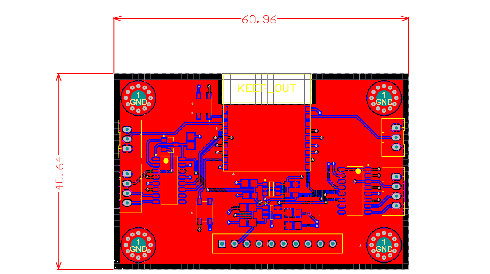
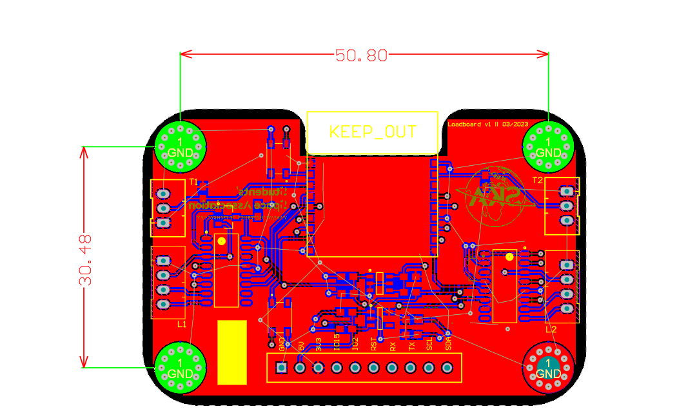
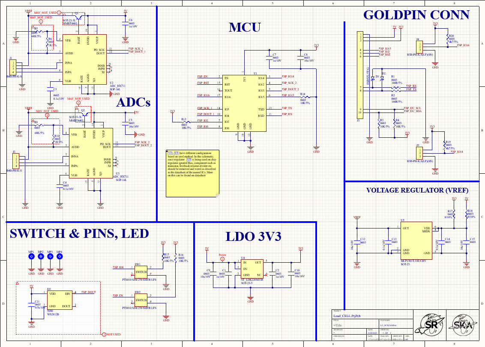

# Loadboard Hardware
# Overview
This board was designed in Altium Designer. Thus, all the associated files can only be openned in Altium Designer.
Some basic description can be given regarding the LoadBoard PCB, one of them being the size of the board. The PCB is 40.64mmx60.96mm (wxl) from tip of the board:
 

And from mounting it is just 30.48mmx50.80mm (wxl):
  

Another important aspect of this board is the layers. Board consist of two layers namely top and bottom.

Manufacturing should not be a problem, since, all the requirements for it has been fultilled by the board. Optimal track-width used for the board is 10mil this is enough since, signal transmission distance is not that long and overall current needed is that high(around 300mA). 

Saturn diagnostigs go here:

# Connections
(Table with all connectors on the board and their functions, this tool is nice: https://www.tablesgenerator.com/markdown_tables)

# Schematic
Schematic of the board is rather simple and easy to read. It consist of 5 ICs(integrated circuit) 5 connectors and other components such as switches and mounting-holes. All of this will be discussed later on the document. Schematic review:

## MCU
Microcontroller is the essential part of this board.
## Buttons
...
## Loadcell amplifiers
...
## Temperature sensors
...
## Voltage Regulator
...
## Voltage Reference
...

# PCB
## Front layer
...
## Back layer
...
## Manufacturing requirements
(Description about layer stack, minimal trace width and distance etc.., basically if it can be manufactured in JLCPCB)

# BOM
(Table with Bill Of Materials)