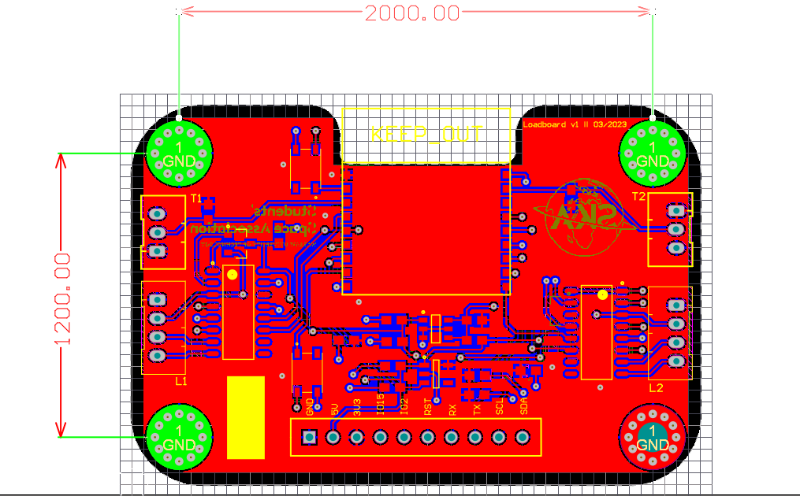
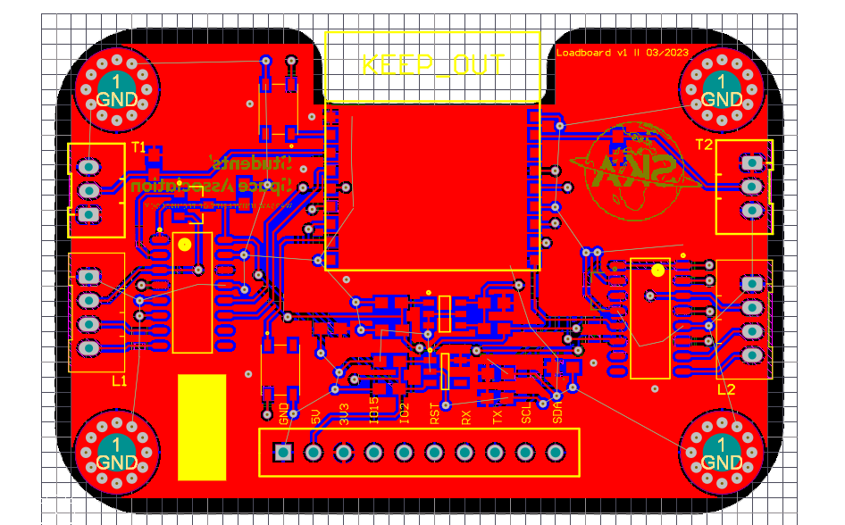
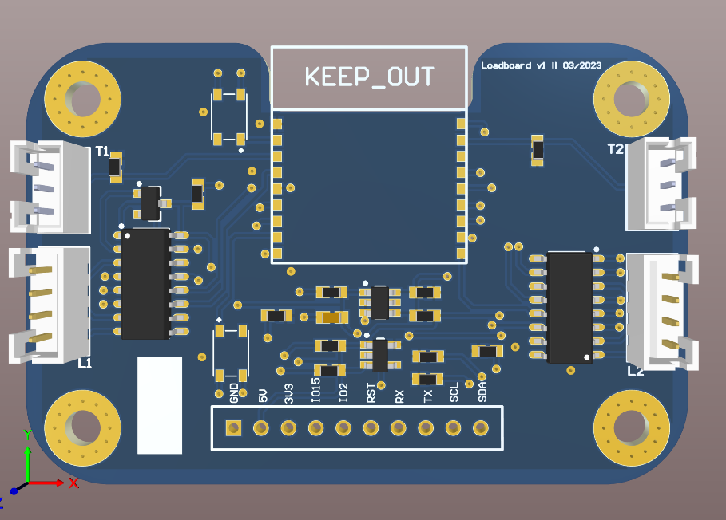
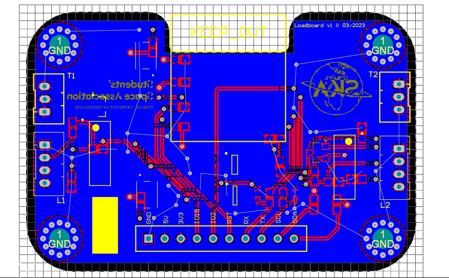
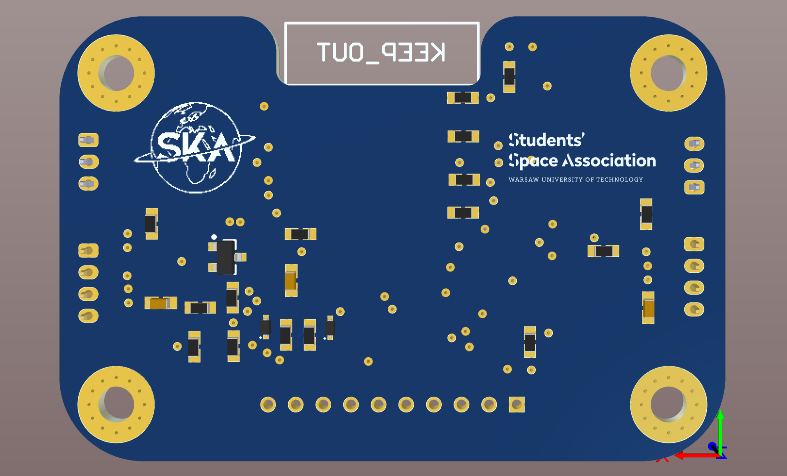
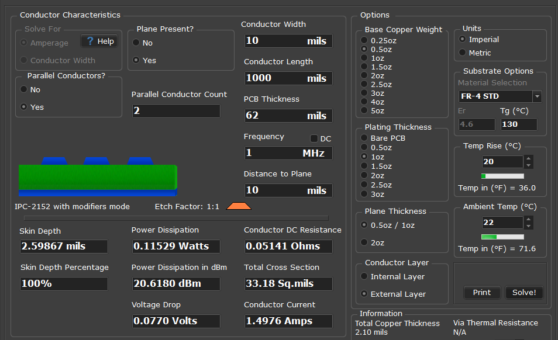

# Loadboard Hardware
# Overview
This board was designed in Altium Designer. Thus, all the associated files can only be openned in Altium Designer.
Some basic description can be given regarding the LoadBoard PCB, one of them being the size of the board. The PCB is 40.64mmx60.96mm (wxl) from tip of the board:
 

And from mounting it is just 30.48mmx50.80mm (wxl):

Another important aspect of this board is the layers. Board consist of two layers namely top and bottom.
Saturn diagnostigs go here:

# Connections
Connectors are also one of the important components on the board. Overall two types of connectors were used on this project namely goldpin and JSTx4 connectors. Below respected connections were given.

Goldpin connector pin description:

| No# | PIN_NAME    | PIN_DESCRIPTION                |
| :-- | ----------- | ------------------------------ |
| 1   | GND         | Ground connection              |
| 2   | 5V          | 5V power supply pin            |
| 3   | 3V3         | 3V3 power supply pin           |
| 4   | ESP_IO15    | GPIO15, Busy: Programming mode |
| 5   | ESP_IO2     | GPIO2, Busy: Programming mode  |
| 6   | ESP_RST     | RESET pin                      |
| 7   | ESP_RX      | UART RX communication pin      |
| 8   | ESP_TX      | UART TX communication pin      |
| 9   | ESP_I2C_SCL | I2C serial clock pin           |
| 10  | ESP_I2C_SDA | I2C serial data pin            |

JST-B4B connector(ADC connectors):

There are two such connectors used in this PCB with pinout as given below:
| No# | PIN_NAME | PIN_DESCRIPTION  |
| :-- | -------- | ---------------- |
| 1   | E+       | Excitation + pin |
| 2   | A+       | Signal pin       |
| 3   | A-       | Signal pin       |
| 4   | E-       | Excitation - pin |

JST-B3B connector(Temperature connectors):

Since this board uses two of those sensors for two loadcells that will be used there are also two connectors. Pinout of such connectors are as below:
| No# | PIN_NAME          | PIN_DESCRIPTION    |
| :-- | ----------------- | ------------------ |
| 1   | 3V3               | 3V3 power supply   |
| 2   | ESP_IO16,ESP_IO14 | Data out 'DO' pins |
| 3   | GND               | Ground Connection  |

# Schematic
Schematic of the board is rather simple and easy to read. It consist of 5 ICs(integrated circuit) 5 connectors and other components such as switches and mounting-holes. All of this will be discussed later on the document. Schematic review:

## MCU
Microcontroller is the most essential part of this board. Here in this case ESP-WROOM-02 is used. Link to the associated part is given: https://kamami.pl/moduly-wifi/563389-esp-wroom-02-modul-z-ukladem-esp8266.html

ESP has two different modes for programming which was configured as it can be seen from the schematic. More about this matter on table of connections and on "Buttons" section. Moreover, IC supports protocols such as I2C, UART, SPI with 16 pins.

Below one can find table of connections between MCU and other electrical components:

| No# |  PIN_NAME  |              PIN_DESCRIPTION               | USED? |
| :-: | :--------: | :----------------------------------------: | :---: |
|  1  |    3V3     |          3.3 V power supply (VDD)          |  YES  |
|  2  |   ESP_EN   |       Chip enable pin. Active high.        |  YES  |
|  3  |  ESP_IO14  |          Temperature sensor 'DO'           |  YES  |
|  4  | ESP_SCK_2  | GPIO12,Clock pin output 'SCK' at HX711(U3) |  YES  |
|  5  | ESP_DOUT_2 |   GPIO13,Data out pin 'DO' at HX711(U3)    |  YES  |
|  6  |  ESP_IO15  |       GPIO15,Programming mode at GND       |  YES  |
|  7  |  ESP_IO2   |       GPIO2, Porgramming mode at 3V3       |  YES  |
|  8  |  ESP_IO0   |       GPIO0, Programming mode at SW1       |  YES  |
|  9  |    GND     |             Ground connection              |  YES  |
| 10  | ESP_DOUT_1 |   GPIO4, Data out pin 'DO' at Hx711(U2)    |  YES  |
| 11  |   ESP_RX   |        Communication, UART 'RX' pin        |  YES  |
| 12  |   ESP_TX   |        Communication, UART 'TX' pin        |  YES  |
| 13  |    GND     |             Ground connection              |  YES  |
| 14  | ESP_SCK_1  | GPIO5, Clock pin output 'SCK' at HX711(U2) |  YES  |
| 15  |  ESP_RST   |              RESET pin for IC              |  YES  |
| 16  |  ESP_TOUT  |               GPIO test pin                |  NIE  |
## Buttons
Overall, two buttons were used for the purpose of controlling the modes of FLASH and UART-DOWNLOAD. This modes are possible with specific configuration of GPIO pins:

- SW1: Is used specifically for IO0 since, it is the main pin that is being changed from GND to 3V3(High).

- SW2: Is used for enable 'EN' pin functionality, since, it is need to turn on and off MCU everytime mode is changed, this can easily be done by such botton.

NOTE: 10K ohm pull-up/pull-down resistors were added to named pins in schematic. 

## Loadcell amplifiers
HX711 is an analog to digital converter specifically designed for weight scale applications. In this project two of such chips are being used for each loadcell sensor module. During assembly this board can be used at two different configurations as given below:

- On-chip analog supply regulator used: When this configuration is being used, few components should be added such as Q1 ob BASE pin, VFB pin should have voltage divider resistor configuration.

- Off-chip analog supply regulator used: WHen using voltage regulator outside of the IC previously mentioned components should be removed.

In both cases rate of data output is set to 10HZ by connection from RATE(RATE=0) to GND. Gain of the HX711 can be set up during programming by different number of pulses to SCK pin. For simplification a table can be given as below, but it is highly recommended to consult to datasheet:

| ESP_SCK_1, ESP_SCK_2 PULSES | INPUT_CHANNEL | GAIN | USED? |
| :-------------------------: | :-----------: | :--: | :---: |
|             25              |       A       | 128  |  YES  |
|             26              |       B       |  32  |  NO   |
|             27              |       A       |  64  |  YES  |

## Temperature sensors
In order to conduct full measurement with maximum precision we also need to include temperature sensor. Apart from obvious reason including temperature sensor also helps detect changes on load-cell modules thus, two of these sensors were included in the project. For connections JST-B3B connectors are used described in `Connections` section. Aditionally, sensor is capable of measuring wide range of temperature (-55deg <-> 125deg). More about the sensor can be found here:

https://botland.store/waterproof-probes/15245-waterproof-probe-with-temperature-sensor-ds18b20-1m-iduino-3ds024-5903351242479.html

## Voltage Regulator
Voltage regulator is the main power element of this PCB. It is responsible for providing other components(MCU, CONN, ADCs) with 3V3 supply voltage. The LDO chose for this board provides 3V3 voltage with 2V to 10V input range. Output current of such LDO is 300mA according to the datasheet with just 200mV voltage drop which is perfect for battery operated board.

IMPORTANT NOTE: It should be noted that minimum input current required for ESP module is 500mA which is in itself a large amount. However, if we take a closer look into ESP datasheet it can be seen that for proper operation of ESP module only 80mA current is required. Therefore, it is safe to say that 500mA requirement is due to current spikes in order to prevent this phenomena and ensure the proper working of ESP-WROOM-02 several capacitors were included. These capacitors ranging from 100nF to 10uF eliminate the excess noice from the power line and keep the module safe. One may ask question why this LDO were not replaced by the one with correct characteristics? Answer of this question lies on supply of such components such that by the time of making this board such LDO with required characteristics were hard to find.

## Voltage Reference
As mentioned before if the on-chip regulator is not being used for HX711, there needs to be seperate voltage reference IC. Its purpose is to provide stable voltage. IC also has coupling capacitors for noise cancellation. IC can be powered from both 3V3 and 5V power supply thus, jumper/resistor with 0 ohms  to choose between. Table of connections can be found below:

| No# | PIN_NAME | PIN_DESCRIPTION       | USED?  |
| :-- | -------- | --------------------- | ------ |
| 1   | OUT      | Output voltage (VREF) | YES    |
| 2   | GND      | Ground connection     | YES    |
| 3   | GND      | Ground connection     | YES    |
| 4   | SHDN     | Shutdown pin          | YES/NO |
| 5   | GND      | Ground connection     | YES    |
| 6   | VDD      | Input supply voltage  | YES    |

Voltage provided from VREF can range from 1V to 5V5. But here in this case it is configured to provide 3V3.

# PCB
## Front layer
Front layer of this PCB is covered by 3V3 polygon for better connectivity 
across 3V3 pads. Most of the components are placed on the front of the board. These components include ADCs (U2, U3),  ESP module (U1) as well as LDO (U4) and Voltage Reference IC(U5). In order to create easy accessability both of the switches were placed in the front layer.
Front layer can be shown as below:

3D version:

## Back layer
Back layer was used mostly for GND plane placement. This creates easy access for GND pads of components such as resistors, capacitors as well as ICs.
Back layer can be demonstrated in such way:

And 3D version:

## Manufacturing requirements
PCB offcially has passed the DRC(design rule check) conducted based on the requirements of the JLCPCB for two layer board which in itself proves that it can be manufactured. For more details JLCPCB's website about such rules can be seen here: 
https://jlcpcb.com/capabilities/pcb-capabilities

Optimal track-width used for the board is 10mil this is enough since, signal transmission distance is not that long and overall current needed is not that high(around 300mA <-> 400mA). 

Via clearance is set to be at least 7mil based on PCB standards.

One can also see Saturn calculation of current through tipical track across the board:

# BOM
| No# | NAME              | DESCRIPTION                                    | Designator                 | QUANTITY | SUPPLIER_LINK                                                                                                               |
| :-- | ----------------- | ---------------------------------------------- | -------------------------- | -------- | --------------------------------------------------------------------------------------------------------------------------- |
| 1   | C                 | Standard Capacitors                            | C1, C2, C6, C7             | 4        | https://www.tme.eu/en/details/vj0603g105kxqcw1bc/mlcc-smd-capacitors/vishay/                                                |
| 2   | C                 | Standard Capacitors                            | C3, C4, C13, C14           | 4        | https://www.tme.eu/en/details/cl03a104kp3nnnc/mlcc-smd-capacitors/samsung/                                                  |
| 3   | C                 | Standard Capacitors                            | C5, C8, C9, C10, C12, C15  | 6        | https://www.tme.eu/en/details/vj0603g105kxqcw1bc/mlcc-smd-capacitors/vishay/                                                |
| 4   | C                 | Standard Capacitors                            | C16, C17                   | 2        | https://www.tme.eu/en/details/cl03a104kp3nnnc/mlcc-smd-capacitors/samsung/                                                  |
| 5   | D                 | ESD protection diode                           | D1,D2                      | 2        | https://www.tme.eu/en/details/esd5z2.5t1g/unidirectional-smd-transil-diodes/onsemi/                                         |
| 6   | J                 | B4B-JST connectors                             | J1,J2                      | 2        | https://www.tme.eu/en/details/b4b-ph-k-s/raster-signal-connectors-2-00mm/jst/b4b-ph-k-s-lf-sn/                              |
| 7   | J                 | Goldpins x 10 2.54mm pitch                     | J3                         | 1        | TME, Botland,Konami                                                                                                         |
| 8   | J                 | B3B-JST connectors                             | J4,J5                      | 2        | https://www.tme.eu/pl/en/details/b3b-ph-k-s/raster-signal-connectors-2-00mm/jst/b3b-ph-k-s-lf-sn/                           |
| 9   | Q                 | Bipolar Transistors - BJT SOT-23 PNP GENPUR    | Q1,Q2                      | 2        | https://www.tme.eu/pl/en/details/mmbt4403-7-f/pnp-smd-transistors/diodes-incorporated/                                      |
| 10  | ESP-WROOM-02      | ESP MCU with wifi support                      | U1                         | 1        | https://kamami.pl/moduly-wifi/563389-esp-wroom-02-modul-z-ukladem-esp8266.html                                              |
| 11  | ADC_HX711         | 24-Bit (ADC) for Weigh Scales                  | U2,U3                      | 2        |                                                                                                                             |
| 12  | MCP1802T-3302I/OT | LDO 200mV, VOUT=3V3, 300mA                     | U4                         | 1        | https://www.tme.eu/pl/en/details/mcp1802t-3302io/ldo-unregulated-voltage-regulators/microchip-technology/mcp1802t-3302i-ot/ |
| 13  | MCP1501T-33E/CHY  | Voltage References                             | U5                         | 1        | https://www.tme.eu/pl/details/mcp1501t-33e_chy/zrodla-napiecia-odniesienia-uklady/microchip-technology/                     |
| 14  | R                 | Standard resistor                              | R1, R2                     |          | https://www.tme.eu/en/details/0603saj0102t5e/smd-resistors/royal-ohm/                                                       |
| 15  | R                 | Standard resistor                              | R3, R4, R13, R14, R15, R16 | 6        | https://www.tme.eu/pl/en/details/0603saj0103t5e/smd-resistors/royal-ohm/                                                    |
| 16  | R                 | Standard resistor                              | R5, R9                     | 2        | https://www.tme.eu/pl/en/details/0603saj0683t5e/smd-resistors/royal-ohm/                                                    |
| 17  | R                 | Standard resistor                              | R6, R10                    | 2        | https://www.tme.eu/pl/en/details/0603saj0102t5e/smd-resistors/royal-ohm/                                                    |
| 18  | R                 | Standard resistor                              | R17, R18                   | 2        | https://www.tme.eu/en/details/0603saj0000t5e/smd-resistors/royal-ohm/                                                       |
| 19  | R                 | Standard resistor                              | R19, R20                   | 2        | https://www.tme.eu/en/details/0603saj0472t5e/smd-resistors/royal-ohm/                                                       |
| 20  | SW                | microswitch; SPST-NO; Pos: 2; 0.05A/16VDC;lack | SW1,SW2                    | 2        | https://www.tme.eu/en/details/pts810sjm250smtrlf/microswitches-tact/c-k/pts810-sjm-250-smtr-lfs/                            |
| 21  | MH                | Mounting holes                                 | MH1.MH2,MH3,MH4            | 4        |                                                                                                                             |